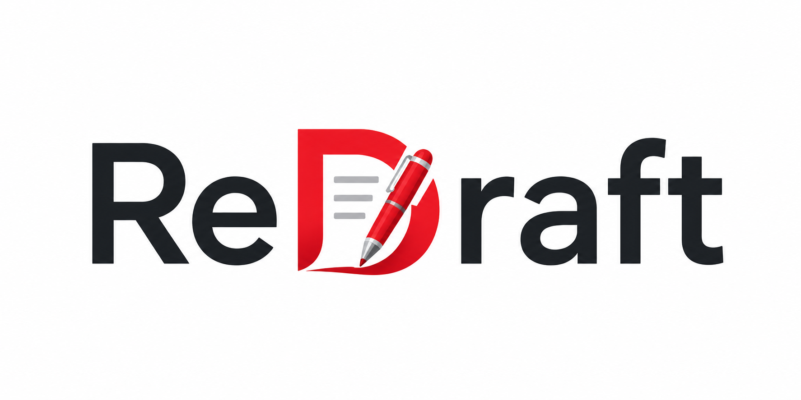

# ReDraft

[](https://www.npmjs.com/package/redraft-local)
[](https://www.npmjs.com/package/redraft-local)
[](https://github.com/tcamise-gpsw/redraft/actions/workflows/ci.yml)

ReDraft is a review workspace for markdown documents. It lets teams browse repository docs, discuss them with inline comment threads, and edit them in either a rich-text editor or raw markdown — backed by GitHub in remote mode or the local filesystem in local mode.

## What it does

- Organizes markdown documents from anywhere in the repository
- Renders markdown documents with comments, activity, and Mermaid diagrams
- Supports inline comment threads, replies, and resolution
- Lets different users work in the mode that fits them best

| Mode | Best for | Data source | Editing style |
|---|---|---|---|
| **Remote WYSIWYG** | Non-technical reviewers | GitHub repository | Rich-text editing in the browser |
| **Remote Markdown** | Technical contributors | GitHub repository | Raw markdown + preview |
| **Local + AI** | Power users and AI agents | Local files on disk | Browser UI + direct file edits |

---

## Remote mode — for reviewers and contributors

Remote mode is the hosted GitHub-backed experience. You connect ReDraft to a repository and browse any markdown document in that repo.

### For non-technical reviewers

Use **View** and **WYSIWYG** modes when you want to read, comment, and make light edits without working directly in markdown syntax.

Typical workflow:
1. Open the hosted ReDraft site.
2. Enter a fine-grained GitHub PAT and `owner/repo`.
3. Choose a document from the tree.
4. Read in **View** mode or switch to **WYSIWYG**.
5. Select text, add comments, reply to threads, and resolve feedback.

### For technical contributors

Use **Raw** mode when you want direct markdown control while still keeping the browser review workflow.

Typical workflow:
1. Connect to the target repository.
2. Open a document from the tree.
3. Switch between **View**, **WYSIWYG**, and **Raw** as needed.
4. Edit markdown directly in **Raw** mode.
5. Save changes back to GitHub with SHA-based conflict protection.

### Remote mode requirements

ReDraft expects a fine-grained GitHub PAT with:
- **Contents: Read/Write**
- **Metadata: Read**

Repository conventions:
- Markdown documents can live anywhere in the repo
- Comment threads live under `.redraft/comments/<mirrored-path>.comments.json`
- Document content and comment files are written with SHA checks for conflict detection

---

## Local mode — for power users and AI agents

Local mode serves the same UI from your machine, but reads and writes local files instead of going through the GitHub API.

### Quick start

**Install once globally, or use directly via npx:**

```bash
npx redraft-local
```

Or install globally and reuse:

```bash
npm install -g redraft-local
redraft-local
```

This starts a local ReDraft server at `http://127.0.0.1:4200` by default. The frontend is bundled into the package — no separate build step required.

**Options:**

```
redraft [directory] [options]
redraft serve [directory] [options]

  --port <number>   Port to listen on (default: 4200)
  --host <string>   Bind address (default: 127.0.0.1)
  --open            Open the browser automatically
  --no-ui           API-only mode, skip serving the frontend
```

`[directory]` is optional. Omit it to serve the current working directory.

**Contributing / running from source:**

```bash
npm install
npm run build
npm run serve
```

What local mode gives you:
- No PAT prompt
- Direct read/write access to local `.md` files
- Structured review threads stored under `.redraft/comments/`
- Live UI updates when files change on disk
- Optional git convenience endpoints for status and commits

### Working with AI agents

Local mode is the intended environment for AI-assisted document workflows.

The design target is:
- Agents edit markdown documents directly on disk
- Agents use the local ReDraft API for structured comment operations

Planned/common AI workflows include:
- Review unresolved comment threads one by one
- Draft or post replies
- Resolve completed threads
- Revise a document based on accumulated feedback
- Summarize open discussions across the repo

---

## How ReDraft works

ReDraft uses one React frontend across all modes.

- In **remote mode**, the browser talks to the GitHub REST API.
- In **local mode**, the browser talks to a local server that mimics the GitHub contents API while reading and writing the filesystem.
- Comment threads are stored separately from document markdown under `.redraft/comments/`, so review discussion remains structured and portable.

For architecture details, see `docs/architecture.md`.

---

## Related documentation

- `docs/architecture.md` — system architecture and data flow
- `docs/development.md` — development setup, build, test, and deployment details
- `docs/specs/` — design specs and approved technical decisions
- `docs/plans/` — implementation plans and execution notes
- `AGENTS.md` — repository guidance for coding agents
