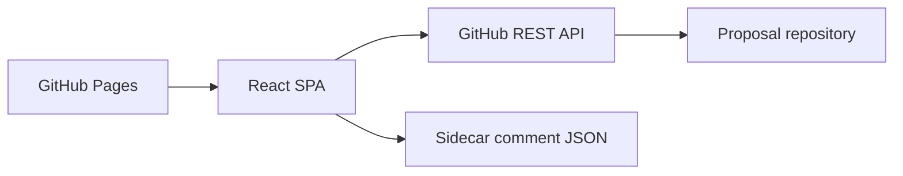

# Proposal Review Workspace

Proposal Review Workspace is a GitHub Pages-hosted React application for browsing, editing, and discussing technical proposals stored as markdown in a GitHub repository.

## Quick start

```bash
npm install
npm run dev
npm run build
```

## Commands

- `npm run dev` — start the Vite dev server
- `npm run build` — produce a production bundle
- `npm run preview` — preview the production bundle locally
- `npx vitest run` — run unit and integration tests
- `npx eslint src/` — lint the application source
- `npx tsc --noEmit` — run the TypeScript compiler in check mode
- `npx prettier --check src/` — verify source formatting
- `npx playwright test` — run browser E2E tests

## What is in this repository

- `src/` — application source code
- `docs/architecture.md` — architecture, data flow, and API usage
- `docs/development.md` — local setup, commands, deployment, and PAT guidance
- `docs/specs/` — approved design artifacts
- `PLAN.md` — approved implementation plan
- `AGENTS.md` — implementation and testing guidance for coding agents

## Architecture summary

The app is a Vite-built React SPA served from GitHub Pages. Proposal markdown and sidecar comment JSON files live in the target GitHub repository and are read and written through the GitHub REST API using a fine-grained PAT stored in localStorage.



## Current feature set

- Auth gate for PAT + `owner/repo`
- Proposal tree from the repo's `proposals/` directory
- Markdown proposal viewing with activity indicators
- Inline comment threads with quote anchoring, replies, resolution, and orphan detection
- Raw markdown editing with save/cancel flow and SHA-conflict protection
- Rate-limit and auth-expiry handling surfaced in the shell

See `docs/architecture.md` for the detailed component breakdown and `docs/development.md` for deployment, configuration, and PAT setup.
