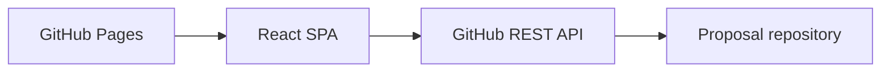

# Proposal Review Workspace

Proposal Review Workspace is a GitHub Pages-hosted React application for browsing, editing, and discussing technical proposals stored as markdown in a GitHub repository.

## Quick start

```bash
npm install
npm run dev
npm run build
```

## What is in this repository

- `src/` — application source code
- `docs/architecture.md` — architecture, data flow, and API usage
- `docs/development.md` — local setup, commands, deployment, and PAT guidance
- `docs/specs/` — approved design artifacts
- `PLAN.md` — approved implementation plan
- `AGENTS.md` — implementation and testing guidance for coding agents

## Architecture summary

The app is a Vite-built React SPA served from GitHub Pages. Proposal markdown and sidecar comment JSON files live in the target GitHub repository and are read and written through the GitHub REST API using a fine-grained PAT stored in localStorage.



See `docs/architecture.md` for the detailed component breakdown and data model.

## Development

All local development and deployment details live in `docs/development.md`.
