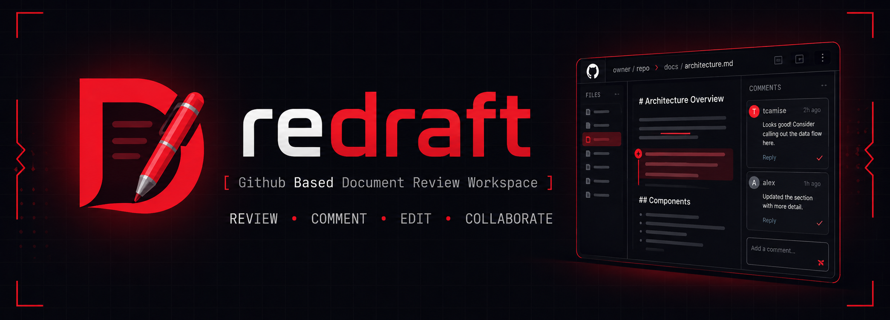
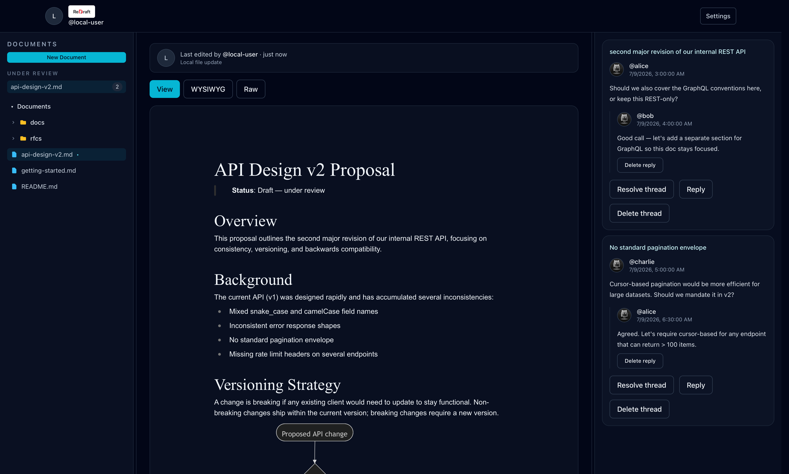
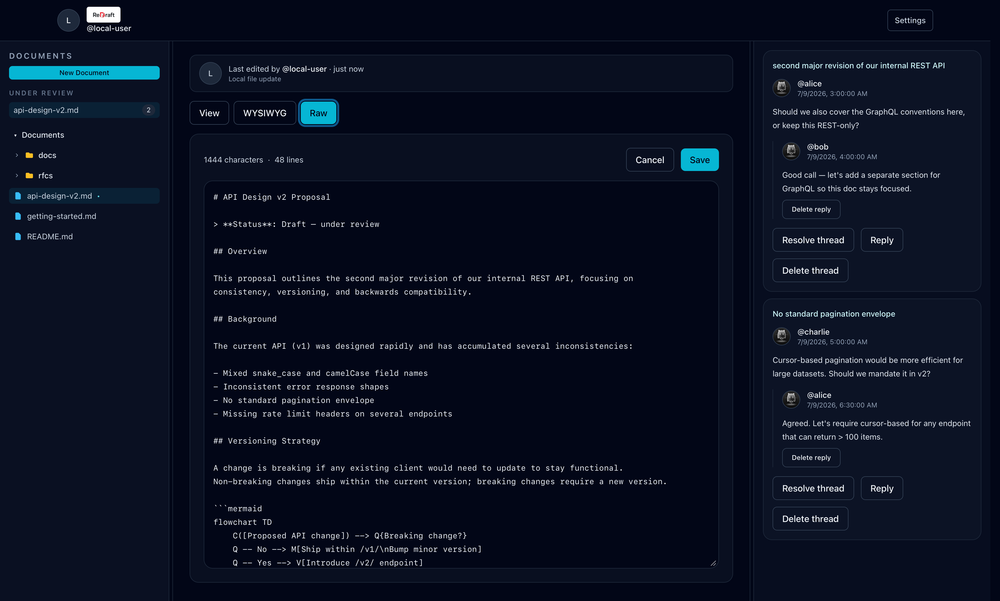
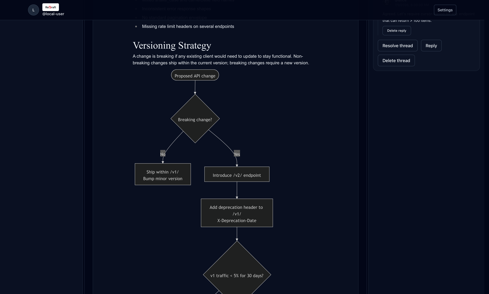

<p align="center">
  
</p>

<p align="center">
  <strong>Collaborative markdown review — powered by a branch in your repo.</strong>
</p>

<p align="center">
  <a href="https://www.npmjs.com/package/redraft-local"></a>
  <a href="https://www.npmjs.com/package/redraft-local"></a>
  <a href="https://github.com/tcamise-gpsw/redraft/actions/workflows/ci.yml"></a>
  <a href="https://redraft-docs.dev"></a>
  <a href="https://www.typescriptlang.org"></a>
</p>

ReDraft turns any Git repository into a review workspace for markdown documents. Select text, leave a comment, reply in threads, resolve feedback — all without leaving the browser. No database, no platform migration, no new accounts. Your documents stay as `.md` files. Review threads live on a sidecar branch. That's it.

**Built for everyone on the team.** Non-technical reviewers use the WYSIWYG editor — no markdown syntax required. Engineers switch to raw mode for full control. AI agents edit files directly on disk. Everyone works on the same documents in the same review threads, each in the mode that fits them.

**Remote and local are the same UI.** Use [redraft-docs.dev](https://redraft-docs.dev) to review any GitHub repo in the browser, or run `npx redraft-local` to serve your local checkout. Local mode lets you edit with your own tools — your editor, your scripts, your AI agents — and see changes reflected live. ReDraft ships with [built-in skills](.agents/skills/redraft-review/) for walking comment threads, drafting replies, and revising documents, so agents work alongside human reviewers out of the box.

**Documentation stays next to the code.** Docs live as plain `.md` files in the same repo as the code they describe — no wiki, no external platform, no sync to maintain. When code changes, the docs are right there to update in the same PR. ReDraft adds a review layer on top without moving anything out of your repository.

---

## Get started

### Remote

Visit [redraft-docs.dev](https://redraft-docs.dev), enter a fine-grained GitHub PAT (`Contents: Read/Write` + `Metadata: Read`), point it at any repo, and start reviewing. Nothing to install.

### Local (advanced)

For power users and AI agents who want to work with local tools:

```bash
npx redraft-local --open
```

Launches a local server and opens the browser automatically. Every `.md` file in your working directory is ready for review — no signup, no PAT, no config. Edit files in your own editor or with AI agents and see changes live in the browser.

---

## How it works

ReDraft stores nothing outside your repository. Documents are plain `.md` files on any branch — pick the branch you want to review from the branch selector. Comment threads live as structured JSON on a dedicated sidecar branch (`redraft` by default) under `.redraft/comments/`. The sidecar branch never touches your working tree — no merge conflicts, no noise in diffs. In local mode the branch is created automatically when you first comment; for remote mode, create it once:

```bash
# one-time setup — create an empty orphan branch for comment storage
bash scripts/create-sidecar-branch.sh   # or: npx redraft-local init (#41)
git push origin redraft
```

See [`scripts/create-sidecar-branch.sh`](scripts/create-sidecar-branch.sh) for details.

```
your-repo/
├── any branch (your documents)
│   ├── proposals/api-design.md
│   ├── rfcs/rfc-001.md
│   └── docs/architecture.md
│
└── redraft (sidecar branch)
    └── .redraft/comments/<document-branch>/
        ├── proposals/api-design.comments.json
        └── rfcs/rfc-001.comments.json
```

One React frontend serves both modes. In remote mode, it talks to the GitHub REST API. In local mode, it talks to a local server that mirrors the same API shape against your filesystem. The code path is identical — only the transport changes.

---

## 01 · Browse, review, and comment

Open any markdown document in the repository. The left sidebar shows the full document tree and highlights documents with active review threads under **Under Review**. The center panel renders the document with full formatting. The right sidebar shows comment threads anchored to the text they reference.

Select text to anchor a comment. Threads support replies, resolution, and deletion. Comments stay anchored even when the document changes — ReDraft uses surrounding context to relocate anchors after edits. If the anchor text is gone entirely, the thread moves to an **Orphaned** section instead of silently disappearing.



## 02 · Three editing modes

Switch between **View**, **WYSIWYG**, and **Raw** depending on how you work.

| Mode        | Editor                      | Best for                             |
| ----------- | --------------------------- | ------------------------------------ |
| **View**    | Read-only rendered markdown | Reading and commenting               |
| **WYSIWYG** | Milkdown rich-text editor   | Non-technical reviewers, light edits |
| **Raw**     | Plain textarea              | Power users who think in markdown    |



## 03 · Mermaid diagrams, code blocks, and full markdown

ReDraft renders the full CommonMark spec plus Mermaid diagrams, fenced code blocks with syntax highlighting, tables, blockquotes, and task lists. What you see in the browser is what your markdown looks like — no surprises.



## 04 · Local mode — just files on disk

```bash
npx redraft-local            # serve current directory
npx redraft-local ./proposals # serve a specific path
```

Everything is plain text. Documents are `.md` files. Comments are `.json` sidecars on a Git branch. Use any tool you want — your editor, `sed`, a Python script, an AI agent. ReDraft watches the filesystem and updates the browser live.

ReDraft ships with a [redraft-review skill](.agents/skills/redraft-review/) that lets AI agents walk unresolved threads, draft replies, resolve feedback, and revise documents through a structured API.

**Options:**

```
npx redraft-local [directory] [options]
npx redraft-local serve [directory] [options]

  --port <number>           Port to listen on (default: 4200)
  --host <string>           Bind address (default: 127.0.0.1)
  --open                    Open the browser automatically
  --sidecar-branch <string> Git branch for comments (default: redraft)
  --no-ui                   API-only mode, skip serving the frontend
```

## 05 · Zero infrastructure

There is no database. No object store. No Redis. No account system. Your data is markdown files and JSON sidecars in a Git repository you already own. Remote mode is a static site on GitHub Pages. Local mode is a single Node process.

---

## Development

See [docs/development.md](docs/development.md) for build, test, and deployment details.

- [docs/architecture.md](docs/architecture.md) — system architecture and data flow
- [docs/specs/](docs/specs/) — design specs and technical decisions
- [AGENTS.md](AGENTS.md) — repository guidance for coding agents
