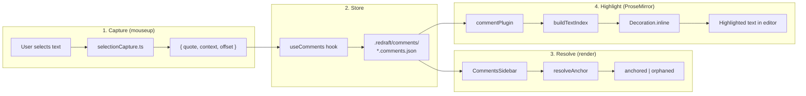
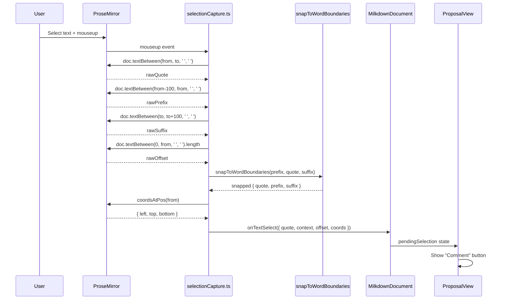
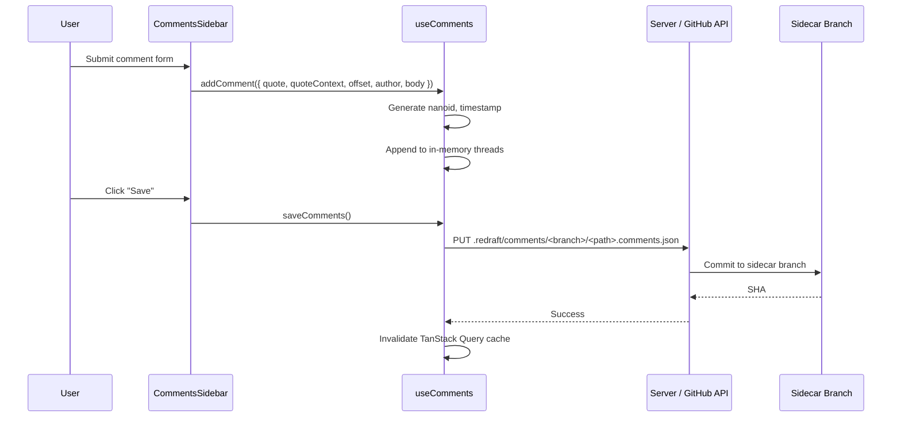
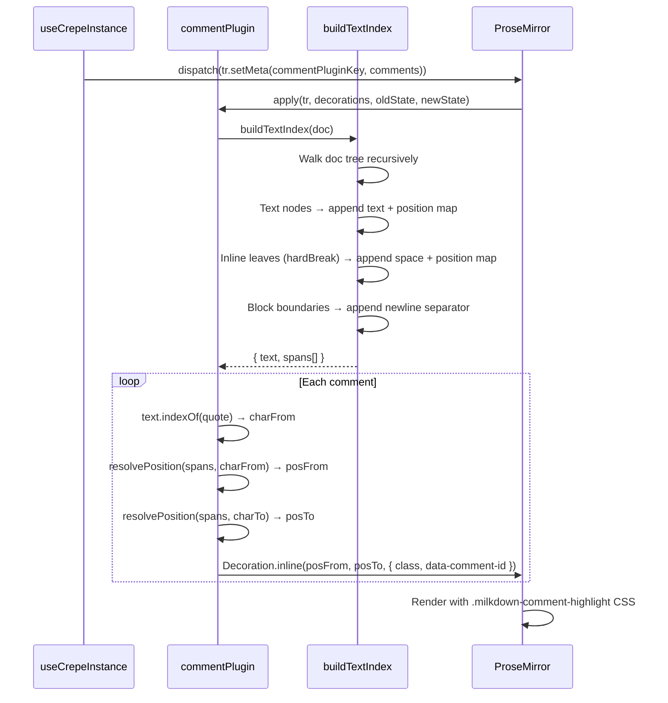
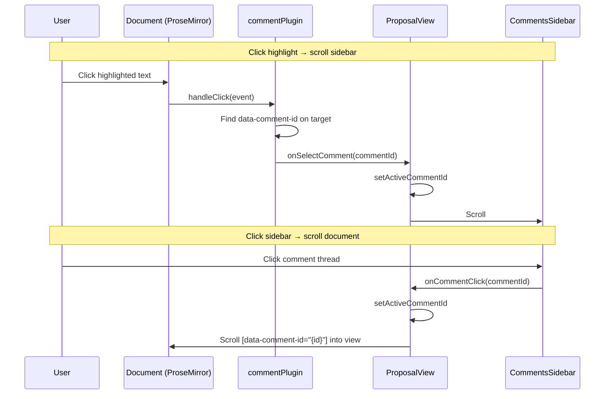

# Comment Anchoring & Highlighting

How ReDraft connects comment threads to document text, keeps them anchored
through edits, and renders inline highlights.

---

## Overview

Every comment thread in ReDraft is anchored to a specific span of text in the
document. The anchoring system has three jobs:

1. **Capture** — when a user selects text and submits a comment, extract a
   portable anchor (quote + context + offset) that can survive document edits.
2. **Resolve** — when the page loads or the document changes, find where each
   stored anchor lands in the current document text.
3. **Highlight** — paint inline decorations on the ProseMirror document so the
   user can see which text each comment refers to.



---

## Data Model

Each comment thread stores the fields needed to re-anchor it later:

```typescript
interface CommentThread {
  id: string;
  quote: string; // the selected text
  quoteContext: {
    prefix: string; // up to 100 chars before the selection
    suffix: string; // up to 100 chars after the selection
  };
  offset: number; // character offset in rendered-text space
  author: Author;
  body: string;
  createdAt: string;
  resolved: boolean;
  replies: CommentReply[];
}
```

These fields are stored in a JSON sidecar file on the `redraft` branch:

```
.redraft/comments/<document-branch>/<path>.comments.json
```

For example, a document at `proposals/api-design.md` on `main` has its comments
at `.redraft/comments/main/proposals/api-design.comments.json` on the `redraft`
branch.

---

## Text Representation

All three subsystems (capture, resolve, highlight) must agree on how to convert
the ProseMirror document tree into a flat string. If they disagree, quotes won't
match and comments will orphan or fail to highlight.

### The canonical representation

All text extraction uses ProseMirror's `doc.textBetween()` with consistent
parameters:

```typescript
doc.textBetween(from, to, ' ', ' ');
//                        │    │
//                        │    └── leafText: inline leaf nodes (hardBreak) → space
//                        └─────── blockSeparator: block boundaries → space
```

| Node type                | Representation           | Example                     |
| ------------------------ | ------------------------ | --------------------------- |
| Text node                | Verbatim content         | `"Hello world"`             |
| Block boundary           | Single space             | `"Heading Overview"`        |
| Inline leaf (hardBreak)  | Single space             | `"focusing on consistency"` |
| Marks (bold, link, etc.) | Ignored — text preserved | `"**bold**"` → `"bold"`     |

### Where each subsystem calls textBetween

| Subsystem                      | File                  | Call                                                                 |
| ------------------------------ | --------------------- | -------------------------------------------------------------------- |
| Quote capture                  | `selectionCapture.ts` | `doc.textBetween(from, to, ' ', ' ')`                                |
| Offset capture                 | `selectionCapture.ts` | `doc.textBetween(0, selection.from, ' ', ' ').length`                |
| Document text (for resolution) | `useCrepeInstance.ts` | `doc.textBetween(0, size, ' ', ' ')`                                 |
| Highlight text index           | `commentPlugin.ts`    | `buildTextIndex()` — manual tree walk, emits `' '` for inline leaves |

The highlight plugin uses its own tree walker (`buildTextIndex`) instead of
`textBetween` because it needs a position map (char offset ↔ ProseMirror
position) to place decorations. The walker produces the same flat string by
emitting a space for each inline leaf node.

---

## Phase 1: Capture

When the user selects text in the ProseMirror editor and releases the mouse:



### Word boundary snapping

If the user's selection starts or ends mid-word, `snapToWordBoundaries`
expands it to the nearest word boundary:

- If prefix ends with `\w+` AND quote starts with `\w`, pull the trailing
  word fragment from prefix into the quote.
- If quote ends with `\w` AND suffix starts with `\w+`, pull the leading
  word fragment from suffix into the quote.

This ensures the stored quote is always a complete-word span.

### The "Comment" button

The Comment button renders at `position: fixed` using the viewport coordinates
from `coordsAtPos(selection.from)`. Clicking it sends the pending selection to
the `CommentsSidebar` where the user types and submits.

---

## Phase 2: Storage

When the user submits the comment form:



Comments are not auto-saved. They accumulate in memory as "dirty" until the user
clicks **Save**, which writes the entire comment file atomically with SHA-based
conflict detection.

---

## Phase 3: Resolution

On page load (or when comments/document text change), the sidebar resolves each
stored anchor against the current document text:

```mermaid
flowchart TD
    START([resolveAnchor called]) --> EMPTY{doc or quote empty?}
    EMPTY -- Yes --> ORPH([Orphaned])
    EMPTY -- No --> OFFSET{offset hint valid?<br/>doc[offset..offset+len] === quote}
    OFFSET -- Yes --> EXACT_OFF([status: exact])
    OFFSET -- No --> SEARCH[indexOf quote in full doc]
    SEARCH --> COUNT{occurrences?}
    COUNT -- "> 1" --> RANK[Score each by context<br/>prefix + suffix match]
    RANK --> BEST([status: exact, best match])
    COUNT -- "= 1" --> SINGLE{Context matches<br/>after normalization?}
    SINGLE -- Exact --> EXACT_ONE([status: exact])
    SINGLE -- Normalized --> CTX_ONE([status: context])
    COUNT -- "= 0" --> CTX_SEARCH[Search by prefix+suffix<br/>indexOf prefix, then suffix]
    CTX_SEARCH --> FOUND{Span between matches<br/>normalized quote?}
    FOUND -- Yes --> CTX_RELOC([status: context])
    FOUND -- No --> ORPH
```

### Resolution tiers

| Tier         | Strategy                             | Cost            | When it fires                       |
| ------------ | ------------------------------------ | --------------- | ----------------------------------- |
| **Offset**   | Check stored offset directly         | O(quote length) | Quote unchanged, no edits before it |
| **Exact**    | `indexOf` scan, rank by context      | O(N)            | Quote moved but text unchanged      |
| **Context**  | Find prefix→suffix window, normalize | O(N)            | Whitespace changed around the quote |
| **Orphaned** | Give up                              | O(1)            | Quote and context both gone         |

The resolver never does fuzzy matching. If all three tiers fail, the comment
moves to the **Orphaned** section in the sidebar with a warning. It is never
silently deleted.

### Context scoring

When multiple exact matches exist, each candidate is scored:

- +1 if the text before the match equals the stored prefix (whitespace-normalized)
- +1 if the text after the match equals the stored suffix (whitespace-normalized)

The highest-scoring candidate wins. Ties break by earliest position.

---

## Phase 4: Highlighting

The ProseMirror comment plugin creates inline decorations for each anchored
comment:



### buildTextIndex

The text index is a parallel data structure that maps between two coordinate
systems:

- **Character offsets** — positions in the flat text string (used for `indexOf`)
- **ProseMirror positions** — positions in the document tree (used for decorations)

```typescript
interface TextSpan {
  charFrom: number; // start in flat text
  charTo: number; // end in flat text
  posFrom: number; // start in ProseMirror doc
  posTo: number; // end in ProseMirror doc
}
```

The walker visits every node in the document:

- **Text nodes** → appends the text content, records the position mapping
- **Inline leaf nodes** (hardBreak) → appends a space, maps it to the node's position
- **Block boundaries** → appends a newline separator (no position mapping needed)
- **Other nodes** → recurses into children

After the walk, `text.indexOf(quote)` finds the character range, and
`resolvePosition()` converts it back to ProseMirror positions for the
decoration.

### Decoration rendering

Each matched quote gets an `Decoration.inline` with:

- CSS class `milkdown-comment-highlight` — renders as a background highlight
- `data-comment-id` attribute — enables click-to-scroll between sidebar and document

### Comment updates

When the comment list changes (new comment, resolve, delete), the parent
component dispatches a ProseMirror transaction with the updated comment array:

```typescript
view.dispatch(view.state.tr.setMeta(commentPluginKey, comments));
```

The plugin's `apply` handler rebuilds all decorations from scratch. When only
the document changes (user editing), existing decorations are mapped through the
transaction mapping, preserving their positions without a full rebuild.

---

## Interaction: Document ↔ Sidebar

Clicking a highlight in the document and clicking a thread in the sidebar are
connected through scroll-into-view:



---

## Sidecar Branch Architecture

Comment data lives on a separate Git branch, completely isolated from the
document content:

```
main (document branch)              redraft (sidecar branch)
├── proposals/                      └── .redraft/
│   ├── api-design.md                   └── comments/
│   └── rfcs/                               └── main/
│       └── rfc-001.md                          ├── proposals/
└── docs/                                      │   └── api-design.comments.json
    └── architecture.md                         └── rfcs/
                                                    └── rfc-001.comments.json
```

Key properties:

- The sidecar branch is an **orphan branch** — no shared history with the
  document branch, so it never appears in diffs or merges.
- Comment files never pollute the working tree — `git checkout main` shows
  only documents.
- In local mode, the server reads/writes the sidecar branch via `git show` and
  `git commit-tree`, never checking it out.
- In remote mode, the GitHub API reads/writes files on the sidecar branch directly.
- The sidecar branch is created automatically on first comment save if it
  doesn't exist.

---

## Failure Modes

| Scenario                                     | Behavior                                    |
| -------------------------------------------- | ------------------------------------------- |
| Quote text deleted from document             | Thread moves to **Orphaned** section        |
| Quote text moved (e.g., paragraph reordered) | Context tier relocates it                   |
| Whitespace changed around quote              | Normalized context comparison still matches |
| Document completely rewritten                | All threads orphan — never silently deleted |
| Sidecar branch doesn't exist                 | Sidebar shows "no sidecar branch" message   |
| SHA conflict on save                         | Write rejected, user prompted to reload     |

---

## Files

| File                                                   | Role                                                                 |
| ------------------------------------------------------ | -------------------------------------------------------------------- |
| `src/components/document/milkdown/selectionCapture.ts` | Captures quote, context, offset, coords on mouseup                   |
| `src/components/document/milkdown/commentPlugin.ts`    | ProseMirror plugin: builds text index, creates highlight decorations |
| `src/components/document/milkdown/useCrepeInstance.ts` | Emits rendered document text for resolution                          |
| `src/lib/comments/anchoring.ts`                        | Pure-function anchor resolver (offset → exact → context → orphaned)  |
| `src/components/comments/CommentsSidebar.tsx`          | Resolves anchors, renders threads, handles comment form              |
| `src/routes/ProposalView.tsx`                          | Wires document text, selection, and comments together                |
| `src/hooks/useComments.ts`                             | Comment CRUD operations and save/load against sidecar                |
| `src/types/comments.ts`                                | `CommentThread`, `CommentReply`, `CommentFile` types                 |
